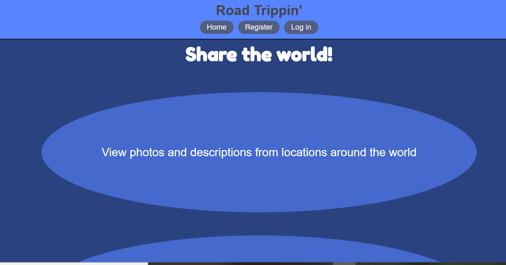

# Road Trippin'

[road-trippin.now.sh](https://road-trippin.now.sh)

## Summary

This app allows the user to register an account and securely log in.  Once inside the user can browse images uploaded by other users, comment on and rate the photos, search by location, upload photos or delete photos they've uploaded and edit text describing the photos they have uploaded.

## Technologies

The technologies I've used here on the front end are, mainly React and React Router, with a little help from CSS, FontAwesome and date-fns.